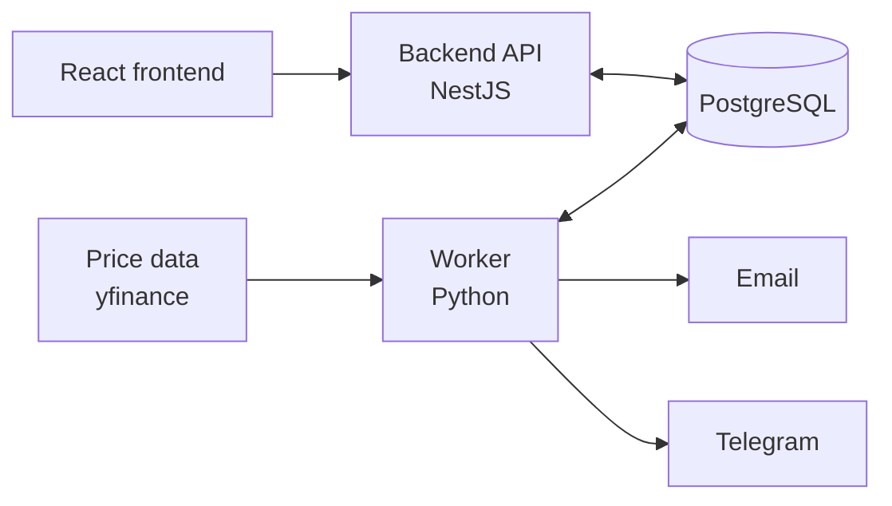

# Stock Alerts

A self-hosted personal stock price alert system. Built-in alert strategies
(moving averages, RSI, MACD, Bollinger Bands, support/resistance) plus
manual price alerts, with a web dashboard and accounts for a small trusted
group of users.

Strategies are templates; each user configures their own **alarms** —
instances of a strategy with their own parameters and ticker (e.g. "RSI on
AAPL, period 14, notify below 30"). Alarms are private to the user who
created them.

> Status: all three services are functional and run via Docker Compose.
> The frontend's UI has not yet been clicked through in a real browser —
> see `frontend/CLAUDE.md`'s "known gap" note.

## Architecture

Three services in one repo, talking only through a shared database.



- **backend/** — NestJS, Clean Architecture. Auth, CRUD for alerts and
  strategies, REST + WebSocket API for the frontend.
- **worker/** — Python. Scheduled job that fetches prices, evaluates
  alert strategies, and writes triggered alerts to the database.
- **frontend/** — React (Vite), built as a static SPA, served by nginx.

The backend and worker never call each other directly — the database is
the integration point.

## Tech stack

| Layer | Choice |
|---|---|
| Backend | NestJS, TypeScript, Prisma |
| Worker | Python (uv), pandas, SQLAlchemy |
| Frontend | React + Vite, served by nginx |
| Database | PostgreSQL |
| Price data | yfinance (Finnhub free tier can't serve historical data — see `worker/CLAUDE.md`) |
| Notifications | Email (SMTP), Telegram |
| Deployment | Docker Compose, self-hosted on a home Linux server |

## Getting started

```bash
cp .env.example .env   # fill in JWT_SECRET, ADMIN_EMAIL/PASSWORD, mail/Telegram creds
docker compose up -d --build
```

This starts Postgres, the backend (migrates the schema and seeds an admin
user on first boot) on `:3000`, the worker (polls on an interval, see
`WORKER_POLL_INTERVAL_SECONDS`), and the frontend on `:5173`. See
`backend/CLAUDE.md`, `worker/CLAUDE.md`, and `frontend/CLAUDE.md` for
running each service outside Docker.

## License

Personal project — no license granted for reuse yet.
